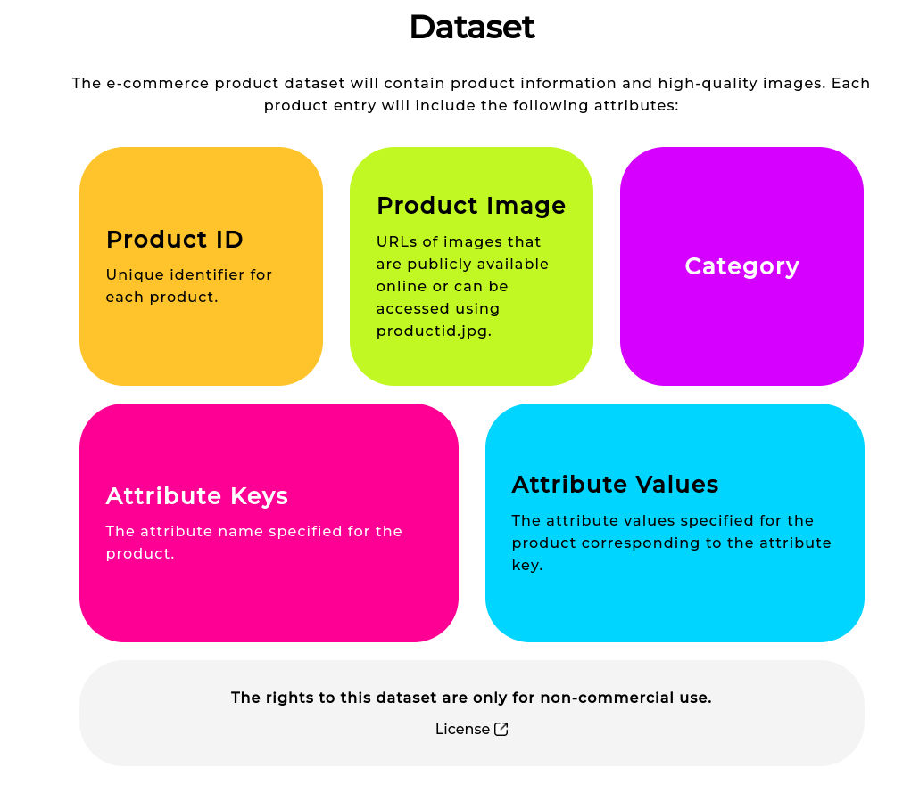

# Meesho Visual Taxonomy Data Challenge - Team ML Maverick

**Members:**

- Neel Shah (Email: neeldevenshah.ai@gmail.com)
- Sneh Shah (Email: 22aiml049@charuat.edu.in)
- Harsh Maheshwari (Email: 22aiml019@charusat.edu.in)

This repository contains the code and methodologies developed for the **Meesho Visual Taxonomy Data Challenge**. The challenge focused on predicting attributes from supplier-uploaded images as part of cataloging for an e-commerce platform. The task is crucial for ensuring accurate and complete attribute information, especially in the Indian e-commerce context, where incorrect or incomplete details are a common issue.

---

## Challenge Overview

### Problem Statement

Have you ever encountered a product on an e-commerce website where the image shows a short-sleeve shirt, but the description states full-sleeve? Predicting such attributes accurately from supplier-uploaded images is critical for any e-commerce platform. Suppliers are required to fill in various attribute details when uploading their products for listing. However, this often results in incorrect or incomplete information.

This challenge motivated the release of a subset of the Meesho product dataset to encourage innovative solutions for attribute prediction in the Indian market.

**Dataset Overview**



---

## Approach and Methodology

Our approach used a deep learning pipeline with the following highlights:

1. **Model Selection:**
   - We employed `facebook/convnext-base-384-22k-1k` as the base feature extractor, pre-trained on ImageNet-22k and fine-tuned on ImageNet-1k for robust feature extraction.
2. **Architecture:**

   - Shared feature backbone using ConvNeXt.
   - Attribute-specific classifier heads tailored to each attribute.
   - Integrated **spatial** and **channel attention mechanisms**.

3. **Training Strategy:**

   - Two-phase training:
     - Initial end-to-end training of the full model.
     - Fine-tuning classifier heads for individual attributes.
   - Utilized **combined Cross-Entropy and MMD loss** for initial training and Cross-Entropy loss for fine-tuning.
   - Augmented training images (e.g., resizing, flipping) to improve generalization.

4. **Efficiency:**
   - The model demonstrated memory-efficient deployment, requiring minimal computational resources.
   - Fast inference times of 9.4–10.4 images per second across categories.

---

## Detailed Report: [Report](./Docs/Team%20ML%20Maverick%20Report.docx.pdf)

## Bug Found During Training

During the third iteration of training, we encountered a **bug** in the following code statement:

```python
model.module.load_state_dict(torch.load(BEST_MODEL_FROM_BASE_FIRST_TRAINING, map_location=device), strict=False)
```

Initially, the strict parameter was set to True, which caused an error while loading the model state. To solve the issue, we set strict=False, allowing mismatched keys between the loaded weights and the model architecture to bypass the error. However, this introduced unexpected changes to the model architecture.

We suspect that these changes may have affected the training process slightly, potentially causing a 1–2% deviation in the final model's performance during the third iteration. This issue was not present in the second iteration of training, which was error-free and robust. Despite this, the overall model performance remained competitive, as evident from the results.

---

## How to Run the code?

**Instructions**

1. If you want to set up the custom environment as that of Kaggle used by us, then you can use the Docker file `gcr.io/kaggle-gpu-images/python`.
2. Change the `input_path` and `working_path` variables according to your environment.
3. Change the `test_c_name` variable from the options [`c1`, `c2`, `c3`, `c4`, `c5`]. The notebook is configured to train a single model at a time, where `c1` represents Men Tshirt, `c2` represents Sarees, `c3` represents Kurtis, `c4` represents Women Tshirt, and `c5` represents Women Tops and Tunics.
4. Change the `NUM_EPOCH` as per the available GPUs for the initial stage training (T1). By default, it is set to `4`. The results attached are for 12 epochs for each category (c1, c2, c3, c4, and c5), based on the 12-hour limit of the Kaggle notebook. Adjust it according to your available GPUs.
5. Change the `NUM_ATTR_EPOCHS` as per the available GPUs for the second stage training (T2). By default, it is set to `1`. The results attached are for 3 epochs for each category (c1, c2, c3, c4, and c5), based on the 12-hour limit of the Kaggle notebook. Adjust it according to your available GPUs.
6. You are ready to go.

**Training Code**

The link to the main notebook for the first half of training: [T1 Training Code](./convexNet-based/v5/new-custom-loss-finetune-512.ipynb)

The link to the main notebook for the second half of training: [T2 Training Code](./convexNet-based/v5/half_training_after_first_model-with-optimized-train-loop.ipynb)

**Infernce Code Including the post-processing**

1. If you want to set up the custom environment as that of Kaggle used by us, then you can use the Docker file `gcr.io/kaggle-gpu-images/python`.
2. Download the weights from the google drive (link: https://drive.google.com/drive/folders/1tRd7yV-L63Wv4T_8sogffr410eRfIGmS?usp=sharing).
3. setup the `input_path`, `working_path` accordingly as per the instructions written in the above sections, and make sure that the csv files and model weights are available at that path.
4. The link to the inference notebook which also includes the post-processing and directly gives output in csv file: [Inference Code](./inference.ipynb)

---

## Results

Our model achieved a **23rd position** on the private leaderboard with a final F1-score of **76.93%**, trailing the top-performing team by only **3.27%**. Despite this, the solution excelled in deployment-friendly performance, requiring minimal GPU resources while maintaining high inference speeds.

### Evaluation Metrics per Attribute as per Validation Dataset

#### Evaluation:

| Category            | Micro-F1-score | Macro-F1-score | Harmonic mean of micro and macro f1 score |
| ------------------- | -------------- | -------------- | ----------------------------------------- |
| Men Tshirts         | 0.972          | 0.967          | 0.969                                     |
| Sarees              | 0.754          | 0.534          | 0.6252                                    |
| Kurtis              | 0.929          | 0.888          | 0.908                                     |
| Women Tshirts       | 0.901          | 0.766          | 0.828                                     |
| Women Tops & Tunics | 0.913          | 0.854          | 0.882                                     |

#### Detailed metrics for Category 1 (Men Tshirts):

| Attribute | Val Loss | Val Accuracy | Weighted F1-score | Micro F1-score | Macro F1-score | Harmonic Mean of F1 |
| --------- | -------- | ------------ | ----------------- | -------------- | -------------- | ------------------- |
| attr_1    | 0.2893   | 0.9100       | 0.9102            | 0.9100         | 0.9133         | 0.9116              |
| attr_2    | 0.0152   | 0.9984       | 0.9984            | 0.9984         | 0.9984         | 0.9984              |
| attr_3    | 0.0518   | 0.9897       | 0.9897            | 0.9897         | 0.9896         | 0.9896              |
| attr_4    | 0.1097   | 0.9645       | 0.9645            | 0.9645         | 0.9431         | 0.9537              |
| attr_5    | 0.0140   | 0.9983       | 0.9983            | 0.9983         | 0.9919         | 0.9951              |
| average   | 0.0962   | 0.9721       | 0.9722            | 0.9721         | 0.9672         | 0.9696              |

#### Detailed metrics for Category 2 (Sarees):

| Attribute | Val Loss | Val Accuracy | Weighted F1-Score | Micro F1-Score | Macro F1-Score | Harmonic Mean of F1 |
| --------- | -------- | ------------ | ----------------- | -------------- | -------------- | ------------------- |
| attr_1    | 0.5766   | 0.7335       | 0.7399            | 0.7335         | 0.5821         | 0.6491              |
| attr_2    | 0.7649   | 0.7002       | 0.6942            | 0.7002         | 0.6440         | 0.6709              |
| attr_3    | 0.2415   | 0.9021       | 0.8894            | 0.9021         | 0.6299         | 0.7418              |
| attr_4    | 0.9826   | 0.5839       | 0.5093            | 0.5839         | 0.4575         | 0.5131              |
| attr_5    | 0.6890   | 0.7398       | 0.7202            | 0.7398         | 0.5924         | 0.6580              |
| attr_6    | 0.3215   | 0.8940       | 0.8754            | 0.8940         | 0.5969         | 0.7158              |
| attr_7    | 0.8439   | 0.6182       | 0.5556            | 0.6182         | 0.4530         | 0.5229              |
| attr_8    | 0.4434   | 0.8315       | 0.7804            | 0.8315         | 0.3240         | 0.4663              |
| attr_9    | 0.9015   | 0.7052       | 0.6804            | 0.7052         | 0.5938         | 0.6447              |
| attr_10   | 0.3686   | 0.8343       | 0.7626            | 0.8343         | 0.4711         | 0.6021              |
| average   | 0.6133   | 0.7542       | 0.7207            | 0.7542         | 0.5344         | 0.6184              |

#### Detailed metrics for Category 3 (Kurtis):

| Attribute | Val Loss | Val Accuracy | Weighted F1-Score | Micro F1-Score | Macro F1-Score | Harmonic Mean of F1 |
| --------- | -------- | ------------ | ----------------- | -------------- | -------------- | ------------------- |
| attr 1    | 0.4018   | 0.8712       | 0.8678            | 0.8712         | 0.7490         | 0.8055              |
| attr 2    | 0.2888   | 0.9105       | 0.9101            | 0.9105         | 0.9021         | 0.9063              |
| attr 3    | 0.4849   | 0.8471       | 0.8466            | 0.8471         | 0.8395         | 0.8432              |
| attr 4    | 0.1976   | 0.9581       | 0.9544            | 0.9581         | 0.8179         | 0.8825              |
| attr 5    | 0.1535   | 0.9537       | 0.9527            | 0.9537         | 0.9429         | 0.9483              |
| attr 6    | 0.2128   | 0.9349       | 0.9350            | 0.9349         | 0.9349         | 0.9349              |
| attr 7    | 0.2329   | 0.9323       | 0.9322            | 0.9323         | 0.9318         | 0.9321              |
| attr 8    | 0.1457   | 0.9686       | 0.9672            | 0.9686         | 0.9463         | 0.9573              |
| attr 9    | 0.0310   | 0.9925       | 0.9928            | 0.9925         | 0.9340         | 0.9624              |
| average   | 0.2387   | 0.9298       | 0.9287            | 0.9298         | 0.8887         | 0.9080              |

#### Detailed metrics for Category 4 (Women Tshirts):

| Attribute | Val Loss | Val Accuracy | Weighted F1-Score | Micro F1-Score | Macro F1-Score | Harmonic Mean of F1 |
| --------- | -------- | ------------ | ----------------- | -------------- | -------------- | ------------------- |
| attr 1    | 0.4894   | 0.8374       | 0.8372            | 0.8374         | 0.8164         | 0.8432              |
| attr 2    | 0.3434   | 0.8858       | 0.8664            | 0.8858         | 0.6241         | 0.7323              |
| attr 3    | 0.3181   | 0.8841       | 0.8736            | 0.8841         | 0.7815         | 0.8296              |
| attr 4    | 0.0911   | 0.9722       | 0.9724            | 0.9722         | 0.9129         | 0.9416              |
| attr 5    | 0.7400   | 0.7482       | 0.7449            | 0.7482         | 0.7269         | 0.7374              |
| attr 6    | 0.1510   | 0.9638       | 0.9598            | 0.9638         | 0.8620         | 0.9101              |
| attr 7    | 0.0406   | 0.9845       | 0.9847            | 0.9845         | 0.9236         | 0.9531              |
| attr 8    | 0.2613   | 0.9375       | 0.9073            | 0.9375         | 0.4839         | 0.6383              |
| average   | 0.3043   | 0.9016       | 0.8932            | 0.9016         | 0.7664         | 0.8232              |

#### Detailed metrics for Category 5 (Women Tops & Tunics):

| Attribute | Val Loss | Val Accuracy | Weighted F1-Score | Micro F1-Score | Macro F1-Score | Harmonic Mean of F1 |
| --------- | -------- | ------------ | ----------------- | -------------- | -------------- | ------------------- |
| attr 1    | 0.4914   | 0.8711       | 0.8690            | 0.8711         | 0.8347         | 0.8525              |
| attr 2    | 0.4670   | 0.8589       | 0.8560            | 0.8589         | 0.8297         | 0.8441              |
| attr 3    | 0.2462   | 0.9195       | 0.9192            | 0.9195         | 0.9176         | 0.9185              |
| attr 4    | 0.3858   | 0.8802       | 0.8807            | 0.8802         | 0.8596         | 0.8698              |
| attr 5    | 0.0818   | 0.9745       | 0.9776            | 0.9745         | 0.7078         | 0.8200              |
| attr 6    | 0.1812   | 0.9477       | 0.9462            | 0.9477         | 0.8696         | 0.9070              |
| attr 7    | 0.2818   | 0.9235       | 0.9239            | 0.9235         | 0.8383         | 0.8788              |
| attr 8    | 0.1994   | 0.9601       | 0.9603            | 0.9601         | 0.9526         | 0.9564              |
| attr 9    | 0.2584   | 0.9395       | 0.9386            | 0.9395         | 0.9153         | 0.9272              |
| attr 10   | 0.5723   | 0.8603       | 0.8621            | 0.8603         | 0.8219         | 0.8407              |
| average   | 0.31653  | 0.91353      | 0.91336           | 0.91353        | 0.85471        | 0.8815              |

---

## Iterative Development

We performed multiple experiments and iterative refinements to achieve these results. All code versions, intermediate approaches, and experimental outcomes are documented in this repository.

### Future Work

One of the promising experiments we plan to revisit is **Vision-Language Modeling**. While this approach demonstrated potential, it required approximately **4 seconds per image** during inference, far exceeding the competition's time constraint of **5 microseconds per image**. Optimization and efficient scaling of such models remain a key area for future exploration.

---

## Data Preprocessing and Augmentation

- Addressed missing values and class imbalance by fine-tuning classifiers with all available data.
- Applied **image augmentations** dynamically, with 50% probability per image during training.
- Resized images to **512x512 pixels** for enhanced feature extraction.

---

Conclusion

This repository demonstrates our journey through experimentation, architectural innovations, and deployment-friendly solutions for the Meesho Visual Taxonomy Data Challenge. Feel free to explore the code, contribute, or provide feedback to enhance this project further.
